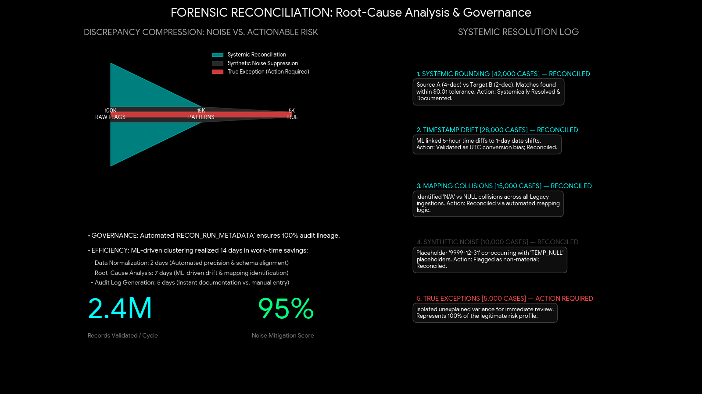

# Enterprise Reconciliation Reporting: Automated Audit Governance

## Strategic Intent: From Discrepancy Hunting to Governed Reconciliation

How do you reconcile high-volume enterprise datasets without drowning teams in false positives, cosmetic differences, schema drift, and immaterial variance?

I built this SAS-based reconciliation framework to convert dataset comparison from manual discrepancy hunting into a governed, tolerance-aware audit workflow. The engine compares two SAS datasets by key, identifies schema and value differences, applies configurable tolerances and normalization rules, records run metadata, and produces review-ready outputs for technical and business stakeholders.

The objective is not only to find differences. The objective is to separate actionable risk from reconciliation noise.

This project demonstrates a practical enterprise analytics principle:

> Reconciliation is most valuable when it explains what changed, why it matters, and which differences require action.

---

## Executive Dashboard

[](./docs/executive_dashboard_preview.png)

[Open dashboard full size](./docs/executive_dashboard_preview.png)

The dashboard translates reconciliation logic into an executive view of discrepancy compression, systemic resolution, operational efficiency, and remaining actionable exceptions.

---

## Core Reconciliation Framework

### 1. Tolerance-Aware Comparison

The engine supports configurable tolerance logic so immaterial differences do not overwhelm reviewers.

Supported comparison controls include:

- numeric absolute tolerance
- numeric relative tolerance
- date tolerance
- time tolerance
- datetime tolerance
- character trimming
- character case normalization
- variable-level exclusions

This allows reconciliation logic to distinguish between operationally immaterial drift and genuine exceptions.

### 2. Schema and Metadata Diagnostics

The framework captures metadata from both input datasets and identifies:

- variables present only in one dataset
- type differences
- format differences
- common numeric variables
- common character variables
- duplicate key groups when enabled

This makes schema drift visible before value-level comparison begins.

### 3. Key Presence and Value Difference Testing

The macro executes a structured comparison workflow:

```text
Dataset A
+
Dataset B
+
Business Keys
+
Optional Variable Configuration
→ Schema Diagnostics
→ Key-Only Presence Testing
→ Tolerance-Aware Value Comparison
→ Final Reconciliation Report
→ Summary Outputs
→ Optional CSV Export
```

The final report consolidates:

- keys present only in one side
- value differences
- type / format differences

### 4. Governance Metadata

Each run records audit metadata into `RECON_RUN_METADATA`, including:

- macro version
- run timestamp
- input datasets
- key list
- selected options

This creates a lightweight but important governance trail for repeatability and review.

### 5. UAT Validation

The repository includes a dedicated UAT validation script that tests the macro against controlled simple and rich A/B datasets.

The UAT coverage validates:

- key-only records
- value differences
- type / format differences
- numeric tolerance behavior
- datetime tolerance behavior
- character normalization
- CSV export behavior
- summary-count consistency

---

## Executive Interpretation

### Discrepancy Compression

Enterprise reconciliations often generate large volumes of raw flags. Many of those flags are not true risk; they are the product of rounding behavior, timestamp drift, schema differences, formatting changes, or known ETL artifacts.

This framework helps compress raw discrepancy volume into a smaller set of reviewable, explainable exceptions.

### High-Fidelity Risk Isolation

The goal is not to inspect every difference manually. The goal is to isolate the records and variables that represent genuine operational, financial, regulatory, or data-integrity risk.

### White-Box Audit Governance

The macro is intentionally transparent. It uses explicit SAS logic, configurable variable-level controls, metadata capture, and documented outputs so reviewers can trace how results were produced.

### No Cold Handoffs

The project includes not only the reconciliation macro, but also a learning aid, job aid, outputs reference, and UAT validation script. This ensures the logic can be understood by analysts, developers, business owners, and reviewers.

---

## Technical Architecture

### Core Engine

Primary source file:

[`src/enterprise_reconciliation_diagnostic.sas`](./src/enterprise_reconciliation_diagnostic.sas)

The core macro is:

```sas
%DATASET_RECONCILIATION_REPORT
```

It compares two SAS datasets using specified keys and produces reconciliation diagnostics, final reports, summaries, and optional CSV outputs.

### Supported Environment

The macro is designed for:

```text
SAS 9.4
Base SAS
SAS Enterprise Guide
No Viya required
```

### Required Inputs

```sas
dA=      /* libref.dataset for dataset A */
dB=      /* libref.dataset for dataset B */
keys=    /* space-separated business keys */
outlib=  /* output library, default WORK */
```

### Optional Variable Configuration

The optional `VAR_CONFIG` dataset supports per-variable controls:

| Field | Purpose |
|---|---|
| `VAR_NAME` | Variable to configure |
| `CLASS_OVERRIDE` | Numeric, char, date, time, or datetime comparison class |
| `NUM_TOL` | Numeric absolute tolerance |
| `DELTA_PCT_TOL` | Numeric relative tolerance |
| `DATE_TOL_DAYS` | Date comparison tolerance |
| `TIME_TOL_SECS` | Time comparison tolerance |
| `DATETIME_TOL_SECS` | Datetime comparison tolerance |
| `CHAR_TRIM` | Trim character values before comparison |
| `CHAR_UPPER` | Uppercase character values before comparison |
| `EXCLUDE_FROM_REPORT` | Exclude noisy variables from selected outputs |
| `COMMENT` | Documentation field for audit context |

### Reconciliation Tests

The macro executes four major diagnostic tests.

| Test | Output | Purpose |
|---|---|---|
| Test 1 | `RECON_VARS_ONLY_IN_ONE` | Variables present only in A or B |
| Test 2 | `RECON_TYPE_FORMAT_DIFFS` | Type and format differences |
| Test 3 | `RECON_KEYS_ONLY_IN_ONE` | Keys present only in one dataset |
| Test 4 | `RECON_VALUE_DIFFS_LONG` | Value differences after tolerance and normalization logic |

### Final Report

The main consolidated output is:

```sas
RECON_FINAL_REPORT
```

It combines:

```text
KEY_ONLY_IN_ONE
VALUE_DIFF
TYPE_OR_FORMAT_DIFF
```

and includes a severity rank for review ordering.

### Summary Outputs

The macro can produce:

| Output | Purpose |
|---|---|
| `RECON_FINAL_SUMMARY_COUNTS` | Counts by difference category |
| `RECON_FINAL_SUMMARY_BY_KEY` | Number of value differences per key |
| `RECON_FINAL_SUMMARY_BY_VARIABLE` | Variable-level difference rates, created during CSV export |
| `RECON_FINAL_WIDE_BY_KEY` | Optional side-by-side wide view when value differences exist |

### CSV Export

Optional CSV export can produce:

```text
recon_final_report.csv
recon_final_summary_counts.csv
recon_final_summary_by_key.csv
recon_final_summary_by_variable.csv
```

CSV export includes a row-count guardrail. If the final report exceeds the configured row threshold and sample-on-guard is enabled, the macro exports the first N rows rather than the full dataset.

---

## Repository Contents

```text
enterprise-reconciliation-reporting/
│
├── README.md
│
├── docs/
│   ├── executive_dashboard_preview.png
│   ├── reconciliation_job_aid.sas
│   ├── reconciliation_learning_aid.sas
│   └── reconciliation_outputs_ref.sas
│
├── src/
│   └── enterprise_reconciliation_diagnostic.sas
│
└── tests/
    └── reconciliation_uat_validation.sas
```

### Core Artifacts

| Artifact | Purpose |
|---|---|
| [`src/enterprise_reconciliation_diagnostic.sas`](./src/enterprise_reconciliation_diagnostic.sas) | Core reconciliation macro |
| [`tests/reconciliation_uat_validation.sas`](./tests/reconciliation_uat_validation.sas) | Simple and rich UAT validation scenarios |
| [`docs/reconciliation_outputs_ref.sas`](./docs/reconciliation_outputs_ref.sas) | Output dataset and CSV reference |
| [`docs/reconciliation_learning_aid.sas`](./docs/reconciliation_learning_aid.sas) | Plain-English SAS learning guide |
| [`docs/reconciliation_job_aid.sas`](./docs/reconciliation_job_aid.sas) | Operational runbook and execution guide |
| [`docs/executive_dashboard_preview.png`](./docs/executive_dashboard_preview.png) | Executive dashboard preview |

---

## How to Run

### 1. Load the Macro

Open and run:

```text
src/enterprise_reconciliation_diagnostic.sas
```

This compiles the `%DATASET_RECONCILIATION_REPORT` macro in the SAS session.

### 2. Prepare Input Datasets

You need two SAS datasets and one or more business keys.

Example:

```sas
work.A
work.B
keys=loan_id customer_id
```

### 3. Optional: Build a Variable Configuration Table

A `VAR_CONFIG` table can define tolerances, normalization rules, exclusions, and comments.

Example controls:

```sas
AMOUNT    NUMERIC   0.01   0.004
NAME      CHAR      TRIM=YES   UPPER=YES
POST_TS   DATETIME  DATETIME_TOL_SECS=1
```

### 4. Execute a Standard Governance Run

```sas
%DATASET_RECONCILIATION_REPORT(
  dA=work.A,
  dB=work.B,
  keys=loan_id customer_id,
  outlib=work,
  var_config=work.var_config,
  check_keys_unique=YES,
  respect_exclusions_tests12=YES,
  add_numeric_deltas=YES,
  add_wide_view=YES
);
```

### 5. Execute a CSV Export Run

```sas
%DATASET_RECONCILIATION_REPORT(
  dA=work.A,
  dB=work.B,
  keys=loan_id customer_id,
  outlib=work,
  var_config=work.var_config,
  export_csv=YES,
  csv_dir='/secure/server/path',
  csv_auto_guard=YES,
  csv_max_rows=1000000,
  csv_sample_on_guard=YES
);
```

---

## UAT Validation

The repository includes:

```text
tests/reconciliation_uat_validation.sas
```

The UAT file creates controlled test datasets and validates expected outputs.

It includes:

- a simple UAT case
- a richer UAT case with type / format differences
- tolerance checks
- character normalization checks
- duplicate-key diagnostics
- CSV export checks
- expected count assertions

The validation logic confirms that final reports and summaries reconcile to expected macro behavior.

---

## Supported v1.0 Boundaries

This repository documents the current v1.0 scope explicitly.

Important boundaries:

- `keys_only_method=MERGE` is the implemented key-only comparison method.
- `RECON_FINAL_WIDE_BY_KEY` is only created when value differences exist.
- The wide view does not apply top-N capping in v1.0.
- Final report value fields use fixed `$200` character length.
- Long-value sidecar outputs are not produced in v1.0.
- CSV guard sampling is first-N sampling, not seeded or stratified sampling.
- Type / format differences are not treated as value differences.
- Excluded variables are removed from type / value comparison when `respect_exclusions_tests12=YES`.

These boundaries are intentional and documented so reviewers understand exactly what the macro does today.

---

## Data Privacy and Interpretation Boundaries

All data and visual outputs in this repository are generated from synthetic or anonymized datasets to protect proprietary information.

This framework demonstrates methodology for high-stakes enterprise and regulatory environments, but it does not expose real customer data, proprietary reconciliation rules, confidential controls, or regulated production pipelines.

Important interpretation boundaries:

- The dashboard metrics are portfolio demonstration metrics, not production audit metrics.
- The macro produces reconciliation evidence; it does not make regulatory conclusions by itself.
- Tolerance settings must be governed by business context.
- CSV exports should be handled carefully when used with sensitive datasets.
- Duplicate-key diagnostics are surfaced for governance review but do not automatically fail the macro.

---

## Portfolio Philosophy

**No Cold Handoffs** — engineering zero-defect, audit-ready results so stakeholders internalize the underlying “why.”

This project is designed to ensure that reconciliation findings are not trapped inside technical outputs. The goal is to convert dataset differences into clear, defensible, stakeholder-ready evidence that supports auditability, risk prioritization, and operational decision-making.
